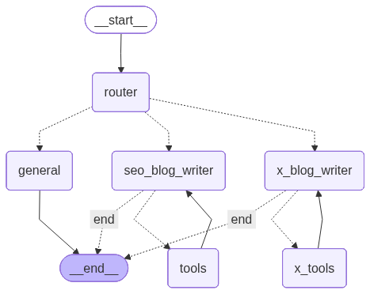

<div align="center">

# 🧠 Multi-Agent Content Writer



**An intelligent, modular content generation system powered by LangGraph and LangChain.**

This project orchestrates multiple specialized AI agents — SEO blog writers, X (Twitter) post creators, and general content generators — into a cohesive, dynamic workflow graph.

</div>

---

## 🚀 Overview

The **Multi-Agent Content Writer** uses a **graph-based architecture** to coordinate multiple AI agents that collaborate to produce high-quality content. Each node in the graph represents a specialized agent or tool, and conditional edges determine the flow of information between them.

### 🧩 Core Components

- **Router Node** → Determines which agent should handle the user’s request.
- **SEO Blog Writer Node** → Generates long-form, SEO-optimized blog posts.
- **X Blog Writer Node** → Crafts concise, engaging posts for X (Twitter).
- **General Node** → Handles generic or fallback content requests.
- **Tool Nodes** → Provide research and data enrichment capabilities.

The system leverages **LangGraph** for workflow orchestration and **LangChain** for LLM-based reasoning and tool integration.

---

## 🧱 Project Structure

```
src/
├── main.py                     # Entry point for running test scenarios
├── graph.py                    # Defines the LangGraph workflow
├── conditional_edges.py        # Logic for routing and continuation decisions
├── general_node.py             # Handles general content generation
├── seo_blog_writer_node.py     # SEO-focused content generation logic
├── x_blog_writer_node.py       # X (Twitter) content generation logic
├── deep_content_research_sub_agent.py  # Research sub-agent for deep content
├── general_internet_search_tavily.py   # Tavily-based web search integration
├── llm_setup.py                # LLM configuration and initialization
├── setup_openai_key.py         # Helper for setting up OpenAI API key
├── setup_tavily_key.py         # Helper for setting up Tavily API key
├── state.py                    # Defines the shared state model (CopyWriter)
└── content_writer_graph.py     # Graph construction utilities
```

---

## ⚙️ Setup Instructions

### 1️⃣ Clone the Repository

```bash
git clone https://github.com/yourusername/multi-agent-content-writer.git
cd multi-agent-content-writer
```

### 2️⃣ Create a Virtual Environment

```bash
python3 -m venv venv
source venv/bin/activate  # On Windows: venv\Scripts\activate
```

### 3️⃣ Install Dependencies

```bash
pip install -r requirements.txt
```

### 4️⃣ Set Up API Keys

You’ll need valid API keys for **OpenAI** and **Tavily**.

```bash
python src/setup_openai_key.py
python src/setup_tavily_key.py
```

These scripts will guide you through securely storing your keys.

---

## 🧠 Running the Project

### Run the Main Test Suite

```bash
python src/main.py
```

This will execute a series of test scenarios:

- **Test 1:** SEO Blog generation
- **Test 2:** X (Twitter) post generation
- **Test 3:** General content generation

Each test prints detailed logs showing the flow between nodes, routes taken, and final outputs.

---

## 🧩 Graph Visualization

To visualize the agent workflow graph:

```bash
python src/graph.py
```

This will generate a `graph.png` file (as shown above) illustrating the relationships between nodes.

---

## 🧰 Key Dependencies

| Library | Purpose |
|----------|----------|
| **LangGraph** | Defines and executes the agent workflow graph |
| **LangChain** | Provides LLM orchestration and tool integration |
| **LangChain-OpenAI** | Connects to OpenAI models |
| **DeepAgents** | Enables multi-agent collaboration |
| **Tavily-Python** | Integrates Tavily search for research tasks |
| **IPython** | Used for visualization and debugging |

---

## 🧪 Example Output

```
============================================================
TEST 1: SEO BLOG REQUEST
============================================================
🧭 Route: seo_blog_writer
🔧 Tool Result: Retrieved top 5 articles on AI in healthcare...
✅ Final Output:
"Artificial Intelligence (AI) is revolutionizing healthcare by..."
```

---

## 🧭 Extending the System

You can easily add new agent types or tools:

1. Create a new node file (e.g., `src/linkedin_writer_node.py`).
2. Define its logic and continuation conditions.
3. Register it in [`src/graph.py`](src/graph.py) using `workflow.add_node()`.

---

## 🧑‍💻 Author & License

**Author:** Kanav Gupta  
**License:** MIT

---

<div align="center">

✨ *Empowering AI agents to collaborate for smarter content creation.* ✨

</div>

